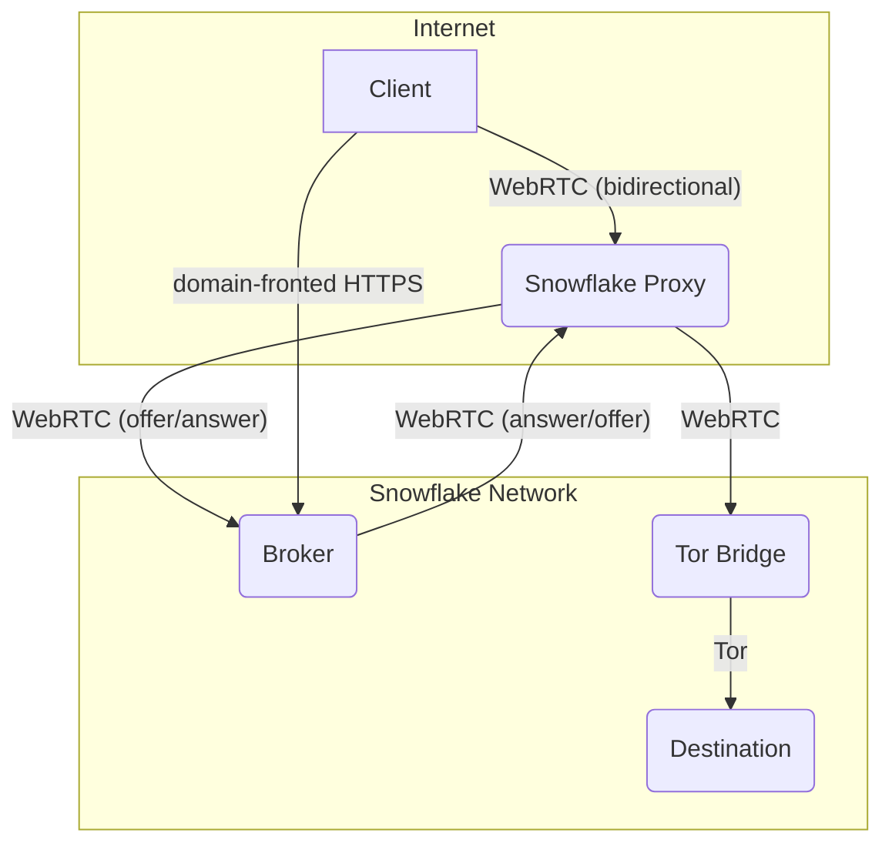

# About

My minimal site, still a work in progress.

## Note

The site currently serves [snowflake](https://snowflake.torproject.org). It's mechanism is simply described below:

The diagram provides a simplified overview of the Snowflake architecture. The actual communication involves more complex interactions, but the diagram captures the main components and their connections.
